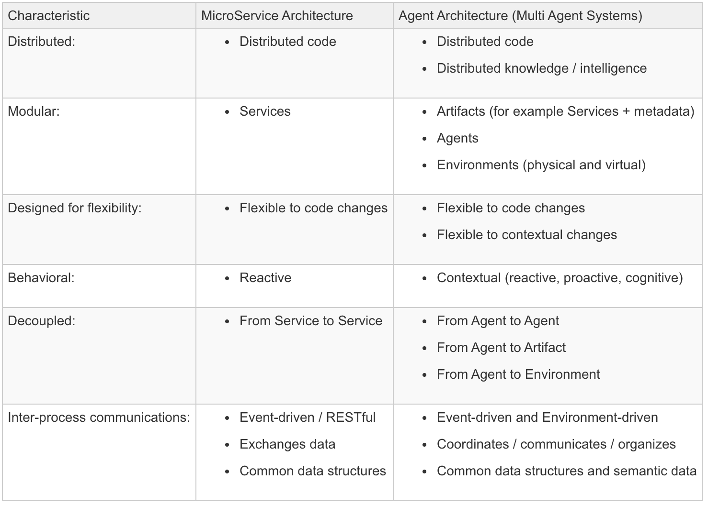

## Intelligent Agents

### Reference points:
* MicroService
* Domain-Driven Design (DDD)
* Internet of Things (IoT)
* Business Process Management (BPM)
* Blockchain
* Streaming Engine & Complex Event Processing (CEP)

### Model-based Agent vs MicroService

### Agent-Oriented MicroService

### References
* https://dzone.com/articles/the-potential-of-agent-architectures
* https://www.linkedin.com/pulse/agent-oriented-microservices-part-i-hemi-trickey/
* https://www.linkedin.com/pulse/agent-oriented-microservices-part-ii-implemented-hemi-trickey/
* https://aws.amazon.com/kinesis/data-streams/
* http://www.conwaylife.com/
* https://thenewstack.io/how-containers-microservices-and-ai-will-lead-to-the-operatorless-data-center/
* https://medium.com/@shivakumar.goniwada/microservices-architecture-in-artificial-intelligence-60bac5b4485d
