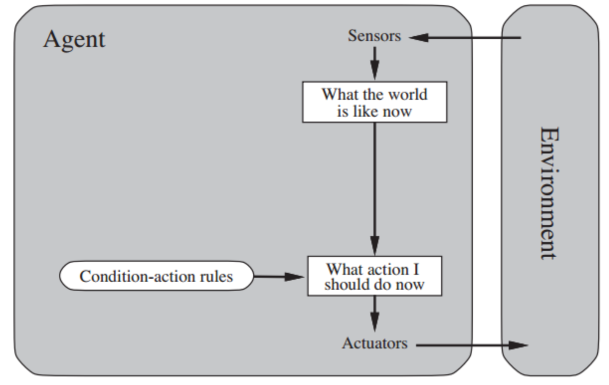
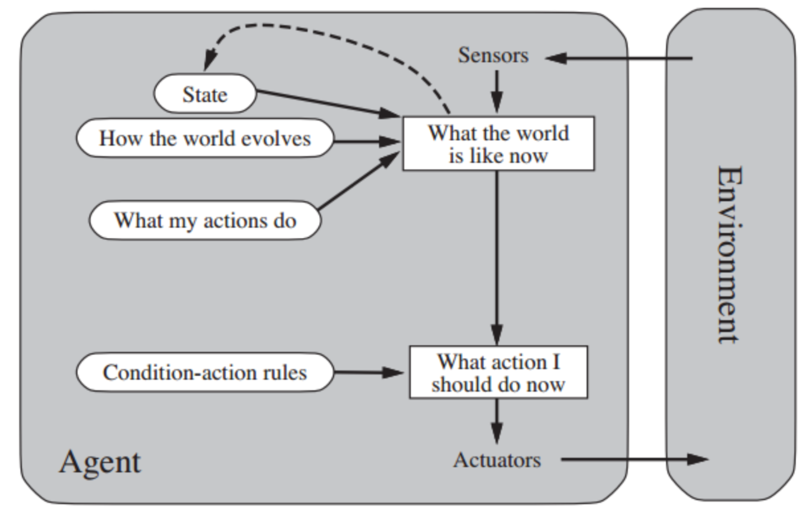
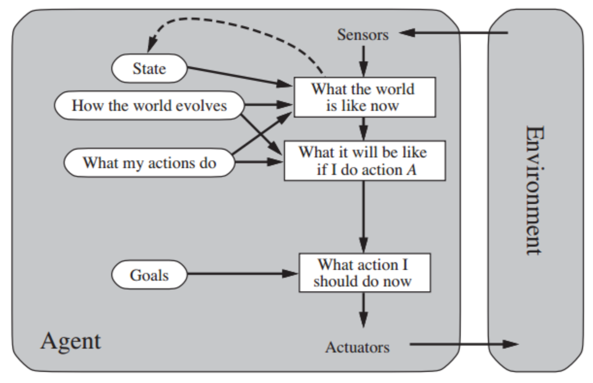
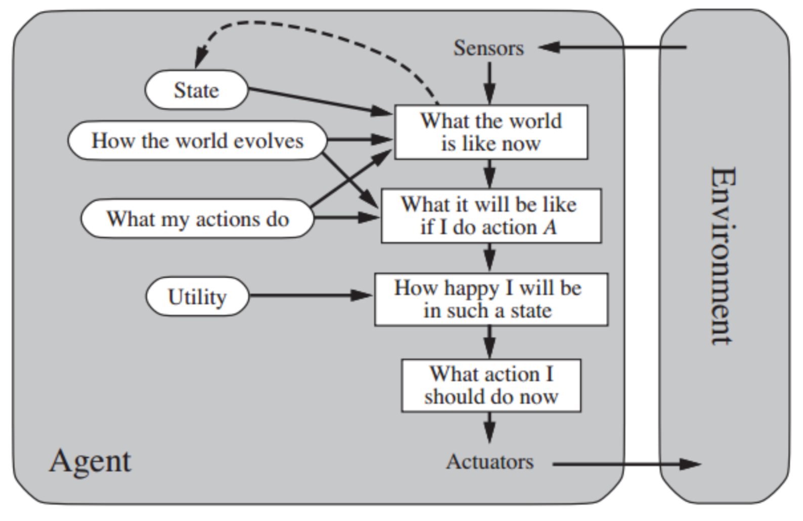

## Agent Architecture

### Reflex Agent

* Require a large **condition-action rules** for realistic scenarios

### Reflex Agent with States

* **Remember the past** through internal state
* Example: The agent does not want to receive more than three emails a day

### Goal-based Agent

* Identify **goal states** where the goal holds
* Perform **actions** that will take the agent to goal states
* **Goal types**:
	* Perform goal: an action
	* Achieve goal: goal state
	* Maintain goal: continue to establish a condition
	* Query goal: obtain piece of information
* **Goal operations**:
	* Adopt
	* Activate
	* Suspend
	* Drop

### Utility-based Agent

* **Utility**: **how good is a state**

### BDI Agent

* **Belief**: What the agent thinks is true
* **Desire**: The **set of states** that the agent would like to be in (may be **inconsistent**)
* **Intention**: A **subset of desires** for which the agent will act towards (**consistent**)
