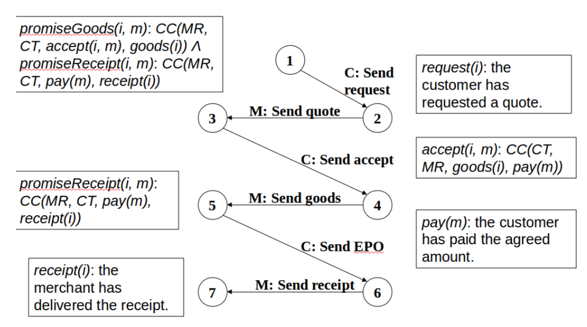
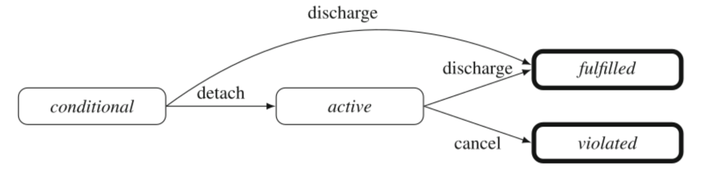
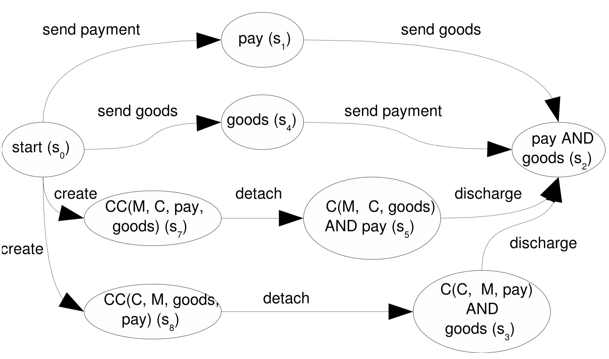
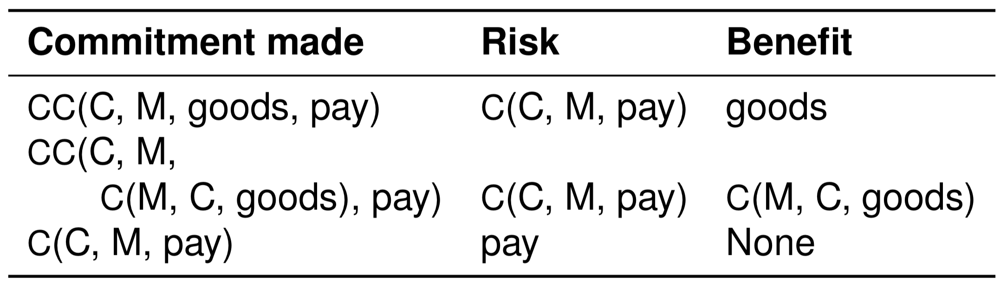
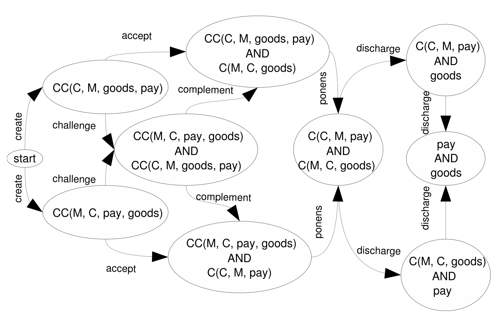
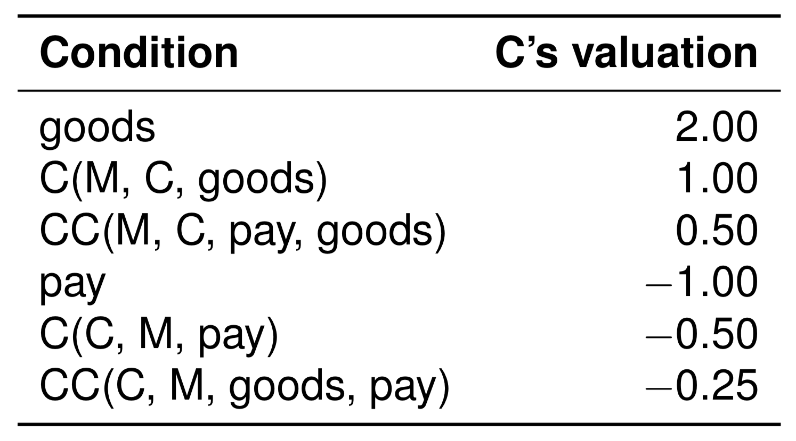
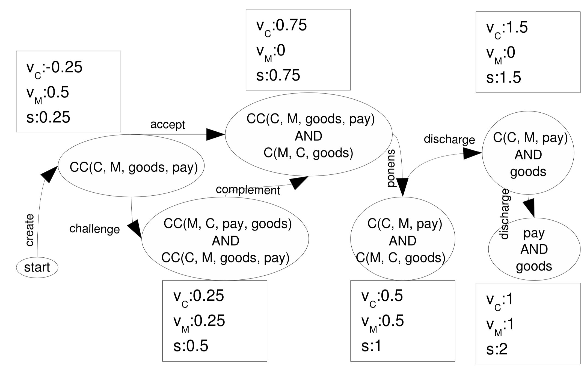

## Commitment

### Social commitment
* C(x, y, p): x commits to y to bring about p (**base-level commitment**)
	* C(customer, merchant, payment)
* CC(x, y, p, q): x commits to y to bring about q, if y brings about p first (**conditional commitment**)
	* CC(customer, merchant, delivery, payment)

**Protocol states** are represented by **Social commitments**:

### Reasoning rules

* **Detach**: CC(x, y, p, q) ceases to exist, if p becomes true, and C(x, y, q) is created.
* **Discharge** active: C(x, y, q) ceases to exist, if q becomes true.
* **Discharge** conditional: CC(x, y, p, q) ceases to exist, if p becomes true, and C(x, y, q) is created.
* **Cancel** active: C(x, y, q) remains open, and q becomes false.

### Benefit and risk of a commitment

The example is as below:

**Benefit** of a commitment: What the agent will gain by creating the commitment

**Risk** of a commitment: What the agent will lose by creating the commitment

### Commitment concession rules

**create-CC**: 
* CC(x, y, p, q)

**challenge**: 
* CC(x, y, p, q) -> CC(x, y, p, q) AND CC(y, x, q, p)

**accept**: 
* CC(x, y, p, q) -> CC(x, y, p, q) AND C(y, x, p)

**complement** (if all agents have taken some risk, take more risk): 
* CC(x, y, p, q) AND CC(y, x, q, p) -> CC(x, y, p, q) AND C(y, x, p)

**ponens** (if other agents are at greater risk, commit more):
* CC(x, y, p, q) AND C(y, x, p) -> C(x, y, q) AND C(y, x, p)

**discharge-C**:
* C(x, y, q) AND C(y, x, p) -> C(x, y, q) AND p

### Valuation

Value of a **proposition** CAN'T have a lower magnitude than a **commitment** of it
* |v(p)| ≥ |v(C(,,p))|
* v({ }) = 0
* v(S1 ∪ S2) = v(S1) + v(S2)
* as **creditor** x, a **proposition** is valued above a **commitment**
	* 0 ≤ v(C(y, x, p)) ≤ v(p)
	* v(C(y, x, p)) ≥ v(CC(y, x, q, p)) ≥ v(q) + v(C(y, x, p))
* as **debtor** y, a **commitment** is valued above a **proposition**
	* 0 ≥ v(C(x, y, p)) ≥ v(p)
	* v(C(x, y, q)) ≤ v(CC(x, y, p, q)) ≤ v(p) + v(C(x, y, q))

### Protocol enactment

C's valuation:

	

M's valuation:
* pay -> 2
* C(C, M, pay) -> 1
* CC(C, M, goods, pay) -> 0.5
* goods -> -1
* C(M, C, goods) -> -0.5
* C(M, C, pay, goods) -> -0.25

**Commitment concession rules** move the protocol to states with higher **social welfare**

