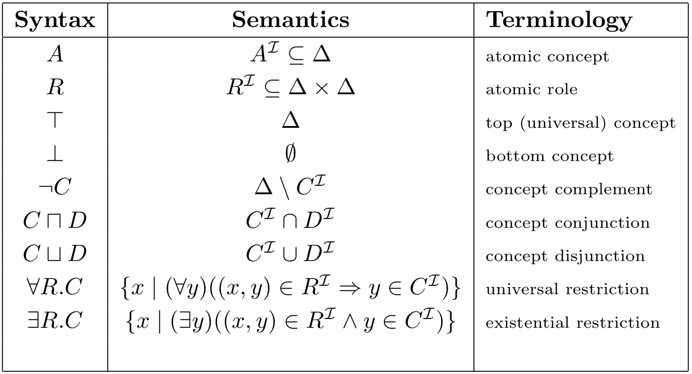
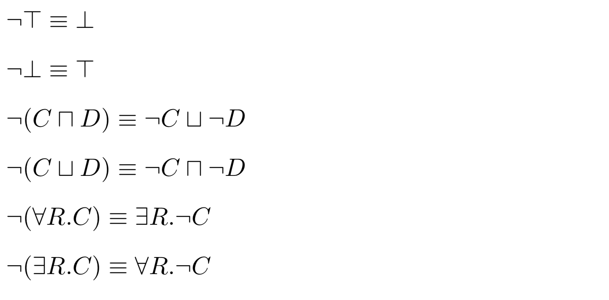

## Description Logic

### Overview

### Syntax

**complex concepts** and **roles** are built from below symbols using **constructors**:
* **concept names**: Person, Male, GreekUniversity
* **role names**: hasChild, isAlumniOf
* **individual names**: ANNA, JOHN

constructors are as below:
* **conjunction**, **disjunction**, **negation** of concepts: Person ⊓ ¬Female, Female ⊔ Male
* **value restrictions**: ∀hasChild.Male
* **number restrictions**: (􏰄􏰄≥3 hasChild), (􏰄􏰄≥3 hasChild.Male), (􏰄􏰄≥3 hasChild) ⊓ Male

**sentences**: it expresses knowledge about a domain by relations between concepts and individuals, and assertions of an individual to a concept.

### Semantics

semantics of sentences are given by **interpretation**:
* an interpretation has a **domain**
* concept names are interpreted as **subsets** of the domain
* role names are interpreted as **binary relations** over the domain
* individual names are interpreted as **elements** of the domain
* complex concepts are defined by **set expressions**: (􏰄≥3 hasChild.(∀isAlumniOf.GreekUniversity)) -> the set of individuals that have at least three children such that all their degrees are from Greek Universities
* TBox and ABox sentences are defined by **set theory**

description logic is a **propositionally closed** language

### Knowledge Base

**knowledge base** (KB) consists of two components:
* **TBox**: **intensional knowledge** or **schema knowledge**, sentences of relations between concepts.
	*  TBox consists of **terminological axiom**:
		* **concept definitions** (if and only if): A ≡ D -> A is defined to be equivalent to D, e.g., Woman ≡ Person ⊓ Female
			* A is **defined concept** or **name symbols**
			* D is **primitive concepts** or **base symbols**
		* **concept inclusions** (if): C ⊑ D -> C is subsumed by D, e.g., Student ⊑ ∃enrolled.Course
			* **disjointness of concepts**: Male ⊑ ¬Female
			* **coverings**: ⊤ ⊑ Male ⊔ Female
			* **domain restrictions**: ∃hasChild.⊤ ⊑ Parent
			* **range restrictions**: ⊤ ⊑ ∀hasChild.Person
* **ABox**: **extensional (assertional) knowledge** or **instance knowledge**, sentences of individuals.
	* **role filling**: hasChild(ANNA, JOHN)
	* **membership in classes**: Female(ANNA), ((􏰄≥3 hasChild) ⊓ Male)(JOHN)
	* ABox is **assertions** of roles and concepts, e.g., R(a, b), C(a)

### Reasoning Problems

reasoning problems which can be solved by **knowledge base satisfiability**:
* **concept satisfiability**: knowledge base K does not entail concept C ≡ ⊥
* **subsumption**: K |= C ⊑ D
	* **taxonomies**
	* **classification**: the task of inserting new concepts into a taxonomy
* **instance cheking**: K |= C(a)

other reasoning problems are as below:
* **answering concept queries**: find all a such that {a | K |= C(a)}
* **realization**: given an individual a, find the most specific concept C such that K |= C(a)
