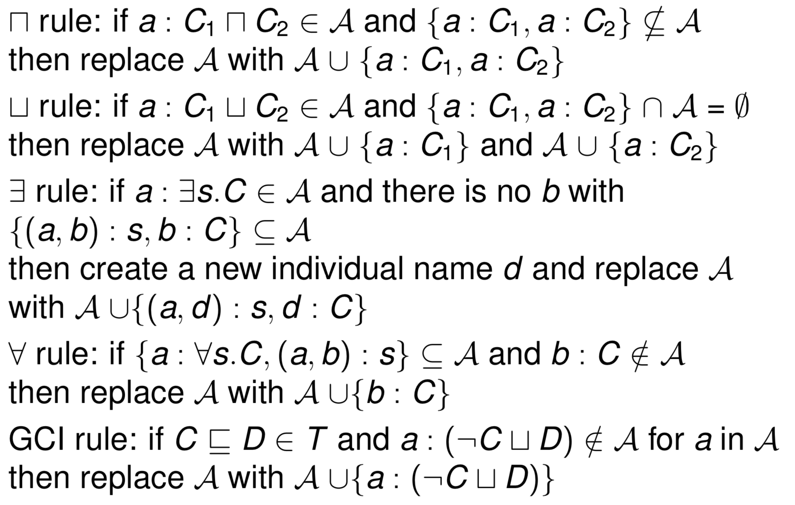
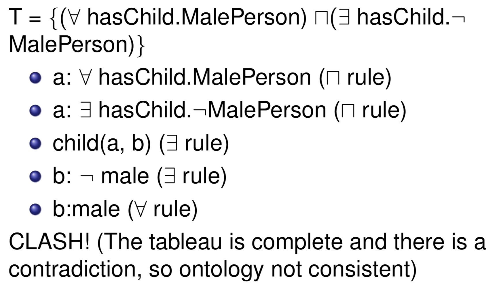

## Description Logic

### Ontology

An agent can use the ontology to reason about its environment.

* **Vocabulary**
* **Semantic interconnection**
* **Rules of inference**

**Ontology components**:
* **Concepts**
	* **Concept properties** with values:
		* Age of a human
	* **Concept instances**:
		* Anna is an instance of a human
* **Relations** among concepts:
	* **Inheritance (isA) relation**
		* Build a **taxonomy**
		* A human is a mammal
	* **Part-whole (isPartOf) relation**
		* Build a mereology
		* A steering wheel is part of a car

### Description Logic

**Intersection**:
* X ⊓ Y
* father ≡ parent ⊓ malePerson

**Union**:
* x ⊔ Y
* person ≡ malePerson ⊔ femalePerson

**Complementary**:
* ¬X 

**Universal Restriction**:
* ∀R.C
* hasOnlySons ≡ ∀hasChild.malePerson

**Existential Restriction**:
* ∃R.C
* hasASon ≡ ∃hasChild.malePerson

**Cardinality Restriction**:
* ≥ nR.C
* ≤ nR.C
* person ⊓ ≥ 5hasChild.happyPerson

**Enumeration**:
* myFriends ≡ {mary, susan, pinar}
* ∃hasFriend.{mary, susan, pinar}

**Top**:
* ⊤ ⊑ ∀hasChild.malePerson

**Bottom**:
* ∀hasChild.malePerson ⊑ ⊥

**Concept Inclusion**: Every X is a Y, thus X is a subset of Y.
* X ⊑ Y
* student ⊑ person ⊓ young
* student ⊑ person ⊓ ∀hasFriend.young

**Equivalence**: Every X is a Y, and every Y is a X.
* X ≡ Y
* student ≡ person (Every student is a person and every person is a student)

**Assertion**: 
* **Role assertion**:
	* R(x, y)
	* hasFriend(mary, susan)
* **Class assertion**: 
	* C(x)
	* student(mary)

### Reasoning
* is one class a **subclass** of another class?
	* ∃hasChild.{mary} ⊑ happyPerson
	* Are all parents of mary happyPerson?
* is one individual an **instance** of a class?
	* happyPerson(mary)?
* list all individuals with the given property.
	* malePerson ⊓ ∃hasChild.{mary} ⊑ happyPerson, find ...

**Reasoning techniques**:
* **Model construction**
	* Prove that **KB does not entail a given axiom** because **a model cannot be constructed**
	* **Tableau algorithms**
* **Proof derivation**
	* Prove that **KB entails a given axiom** because **a proof can be found**
	* **Rule-based algorithms**, **completion algorithms**

### Tableau algorithm

Decide the **consistency** of an ontology:
* O = T, A
* TBox axioms (schema) 
* ABox axioms (data, already-known facts)

How it works:
* Start with **ABox**
* Add **Tbox** in **Normal Negation Form** (Push the negation inward)
	* ¬(C ⊓ D) ≡ ¬C ⊔ ¬D
	* ¬(C ⊔ D) ≡ ¬C ⊓ ¬D
	* ¬(∀R.C) ≡ ∃R.¬C
	* ¬(∃R.C) ≡ ∀R.¬C
* Keep applying expansion rules to derive more facts
* Find a clash

**Expansion rules**:

Example is as below:

