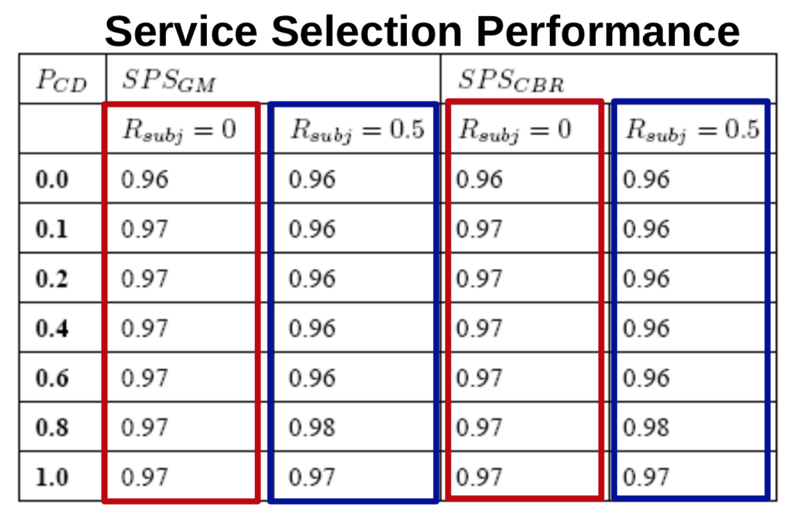

## Experience

* **Rating-based** approaches are sensitive to **context-change** and **subjectivity**
* **Ontology-based** experiences are **context-aware** and can successfully handle **subjectivity**
	* **Cased-Based Reasoning (CBR)**:
		* Score for experience i: Si = recencyi × simi × sati
		* recencyi: recency factor
		* simi: similarity factor (**context similarity** to the current demand)
		* sati: satisfaction factor
	* **Gaussian Model (GM)**: 
		* Select the provider with the **highest satisfaction probability**

Comparison between CBR and GM (PCD = The change of context for service demand):

	
	

