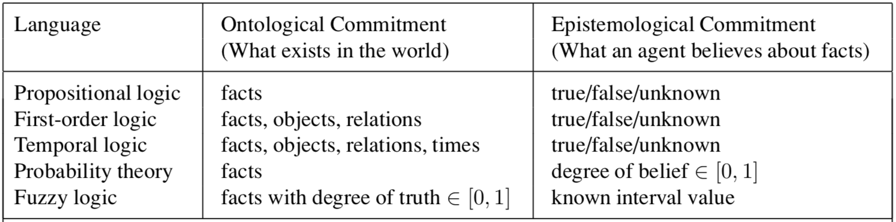
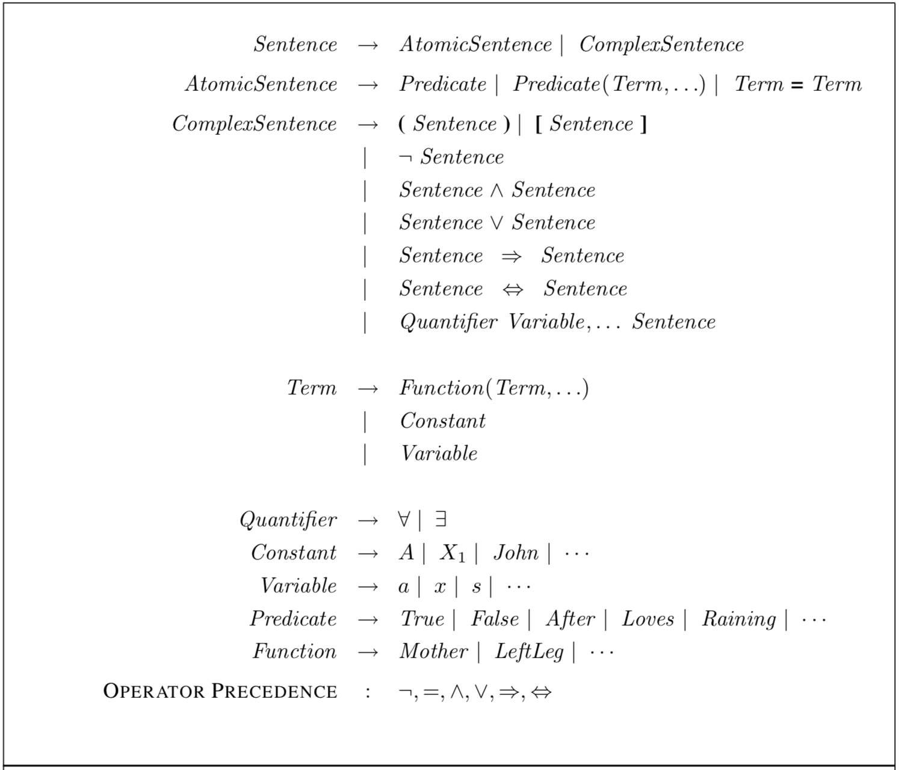
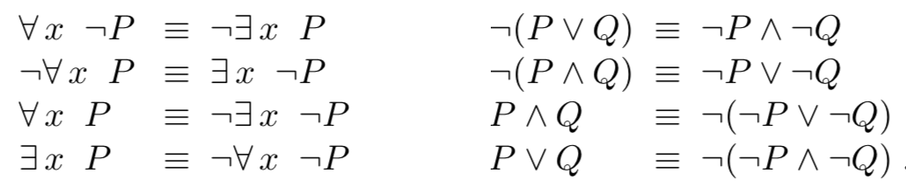

## First-Order Logic

### Comparison

### Syntax

BNF (Backus–Naur Form) grammar of sentences in first-order logic:
* **constant symbols** -> objects
* **predicate symbols** -> relations
* **function symbols** -> functions 
* predicate symbols and function symbos have **arity**, which fixes the number of arguments
* **universal quantification**: ∀x King(x) ⇒ Person(x) 
* **existential quantification**: ∃x Crown(x) ∧ OnHead(x, John)
* **equality symbol**: 
	* Father(John) = Henry -> the object referred to by Father(John) and the object referred to by Henry are the same
	* ∃x,y Brother(x, Richard) ∧ Brother(y, Richard) ∧ ¬(x=y) -> two variables are not the same by negation

### Logical equivalences

 ∀ is a conjunction over objects, and ∃ is a disjunction over objects, so they obey De Morgan’s rules:
 * ∀x Likes(x, IceCream) ≡ ¬∃x ¬Likes(x, IceCream)
 * ∀x ¬Likes(x, Parsnips) ≡ ¬∃x Likes(x, Parsnips)
 
 

### Knowledge Base

**assertions**: sentences that are added to a knowledge base using TELL
* TELL(KB, King(John)) 
* TELL(KB, ∀x King(x) ⇒ Person(x)) 

**queries** or **goals**: questions that are asked to a knowledge base using ASK
* ASK(KB, Person(John))
* any query that is logically entailed by the knowledge base should be answered affirmatively -> ASK(KB, Person(John)) returns true

**theorems**: theorems are entailed by **axioms**