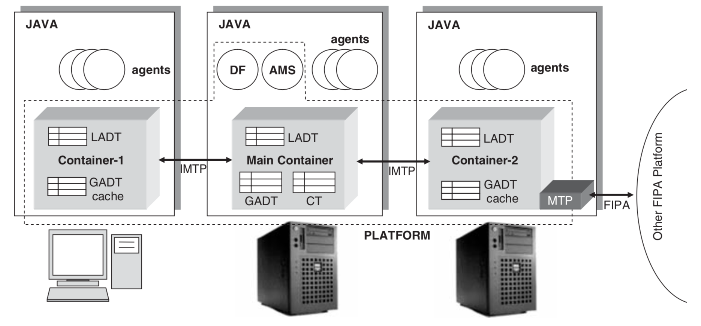
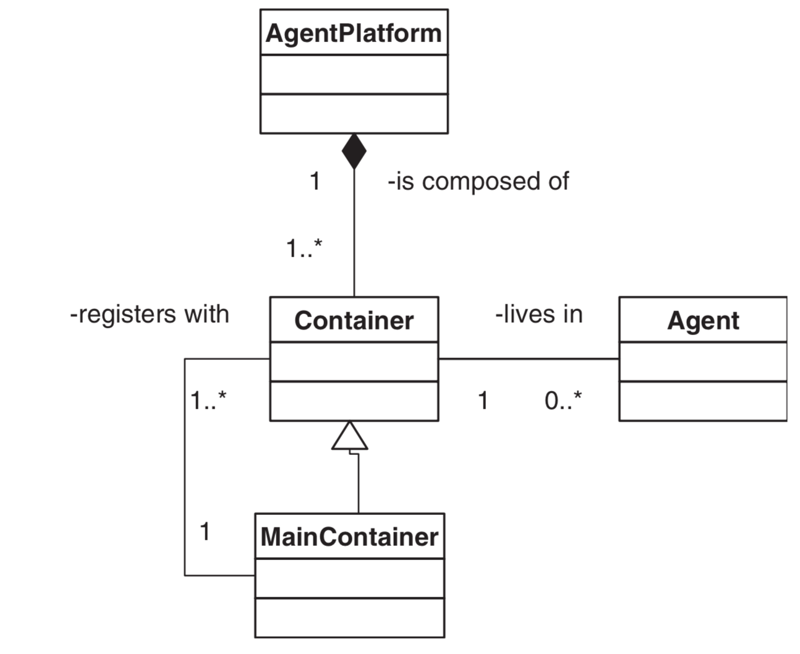

## JADE

### Architecture

* **DF** (Directory Facilitator): Agent service registration
* **AMS** (Agent Management Service): Agent registration
* **GADT** (Global Agent Descriptor Table): Agent registration, incl. agents' status and location
* **LADT** (Local Agent Descriptor Table)
* **CT** (Container Table): Container registration, incl. containers' object reference and transport address
* **MTP** (Message Transport Protocol)
* **IMTP** (Internal Message Transport Protocol)

It has a close resemblance to MicroService architecture:
* Main Container <-> Eureka Server
* Container <-> Docker
* Asynchronous Message-Based Communication <-> RabbitMQ

### Container

### References

* https://jade.tilab.com/

