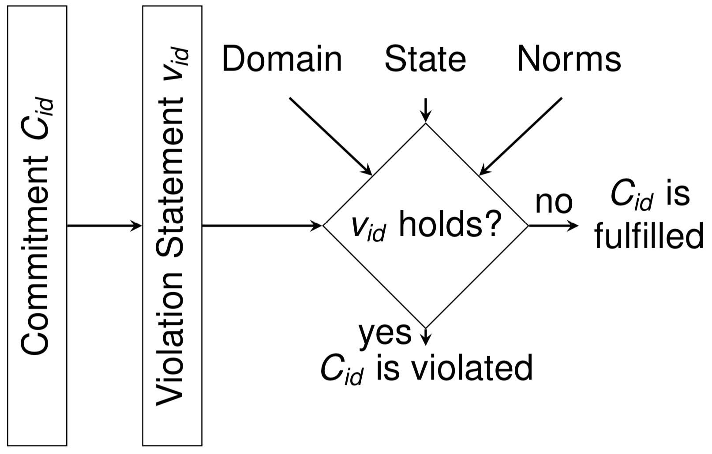
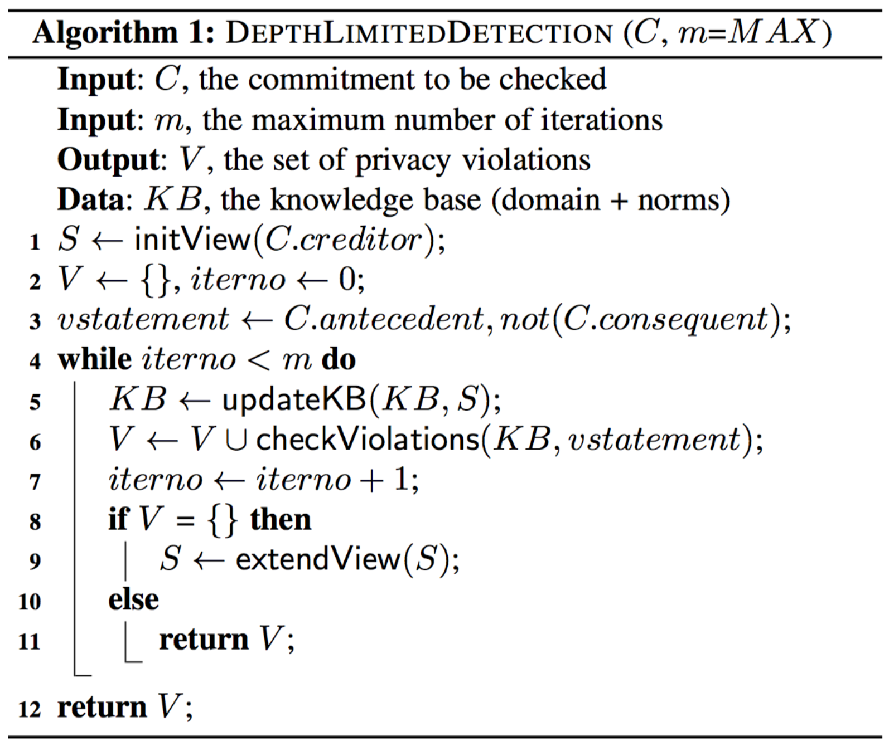
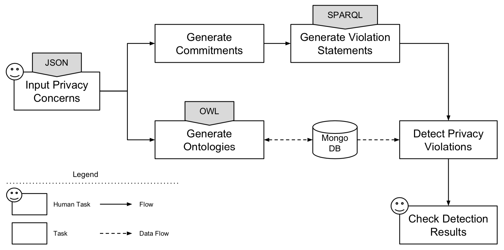
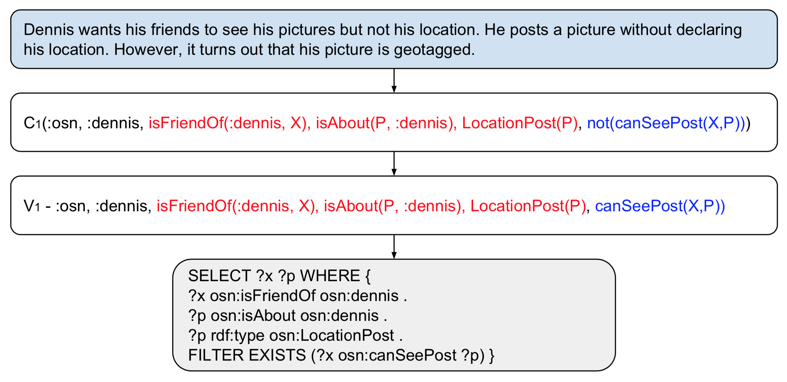
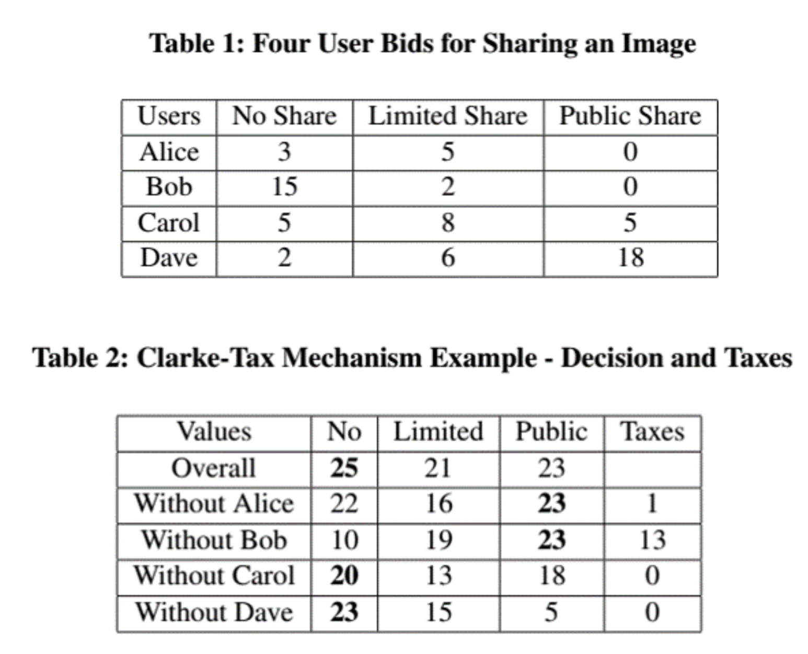
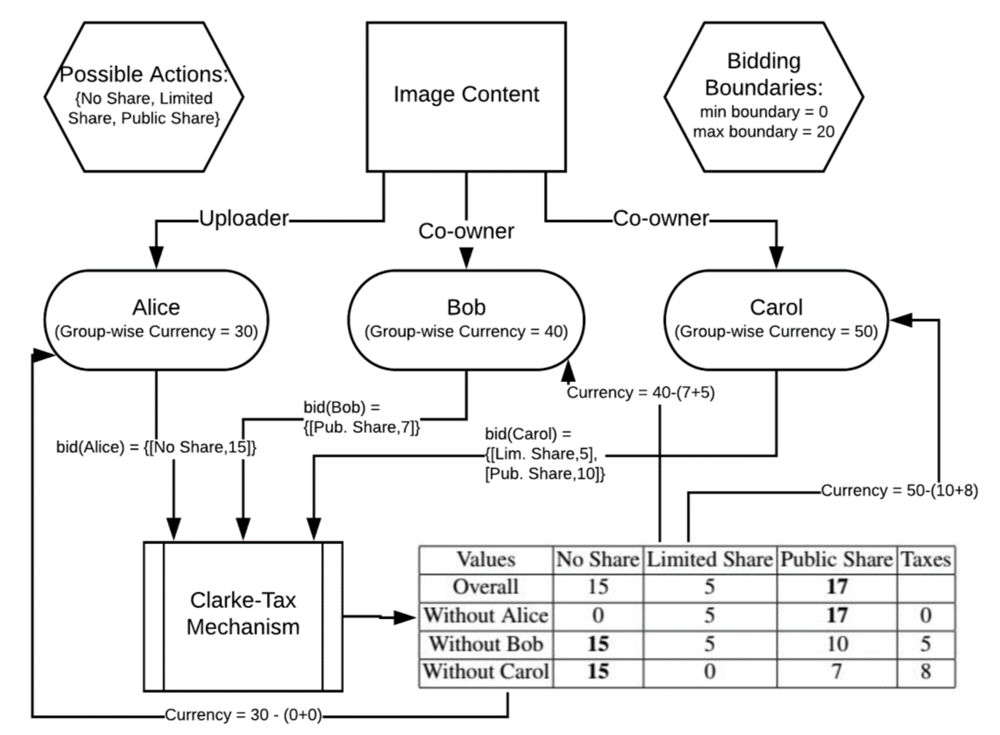

## Privacy

### Authorization Types

* **Opt out**: Default is to share
* **Opt in**: Default is not to share
* **Implied consent**: Your email address appears on the instructor’s list for **possible future communication**
* **Informed consent**: It is explicitly explained **how and which information will be used** - **General Data Protection Regulation** (**GDPR**)
* **Expressed consent**: It is explicitly specified by the user by **checking a box** or similar

### Privacy in OSN (Online Social Network)

* **Temporal**: Pictures taken at night NOT to be shown
* **Contextual**: Pictures taken at the beach NOT to be shown
* **Cultural**: Pictures of eating during Ramadan NOT to be shown
* **Purposeful**: NOT sharing for advertising
* **Co-owned content**

### Representations of Privacy Preferences

* **Access control**
* **Role-based**
* **Relation-based**
* **Attribute-based**
* **Policy-based**: Enable **rules** to work in harmony

### PriGuard: Privacy Violation Detection

* **Commitment**: **C(debtor; creditor; antecedent; consequent)** represents the **privacy agreement** between a user and OSN
	* C(:osn; :dennis; isFriendOf(:dennis,X), sharesPost(:dennis,P), MediumPost(P); canSeePost(X,P))
* **Violation Statement**: The **antecedent** is true, but **consequent** is not true
	* V: isFriendOf(:dennis,X), sharesPost(:dennis,P), MediumPost(P) -> not(canSeePost(X,P))
* **Domain**: **Axioms**
	* Domain: Agent, Post, Audience, Context, Content ⊑ ⊤
	* Role Inclusion: isFriendOf ⊑ isConnectedTo
	* Role Restriction: ∃canSeePost.⊤ ⊑ Agent, ⊤ ⊑ ∀canSeePost.Post
* **Norms**: Post(P) ∧ hasMedium(P,M) ∧ hasGeotag(M,T) → LocationPost(P)
* **View**: A given state of the network

Example is as below:

### PANO: Privacy Auctioning

* **Clarke-Tax Mechanism** provides an **auction** mechanism where participants **bid for different possible actions** in the environment
* Participants whose bids are decisive on the final action are **taxed** according to the **value** they put on it

How to calculate **tax**?

Example is as below:

### Assumption Based Argumentation (ABA)

