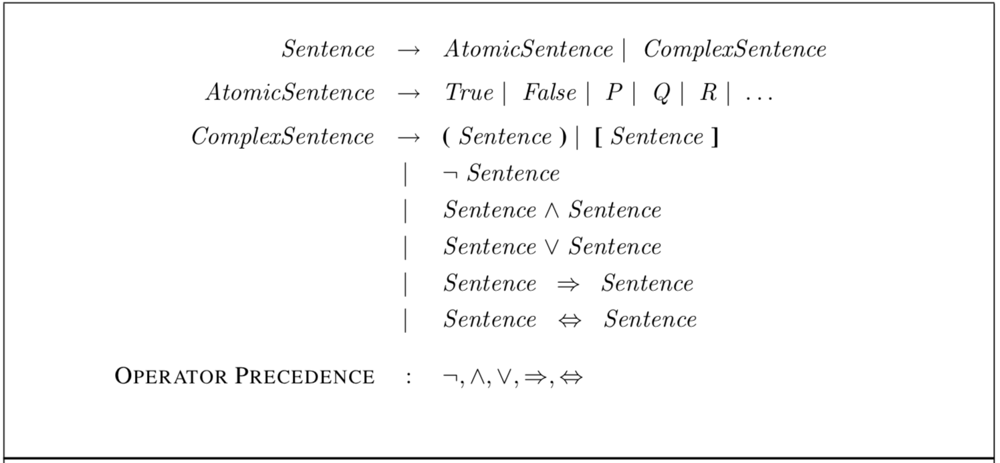
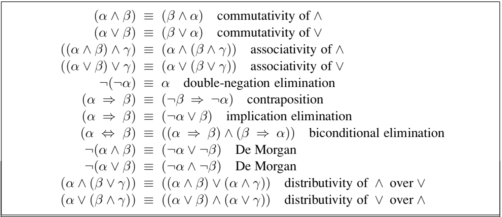
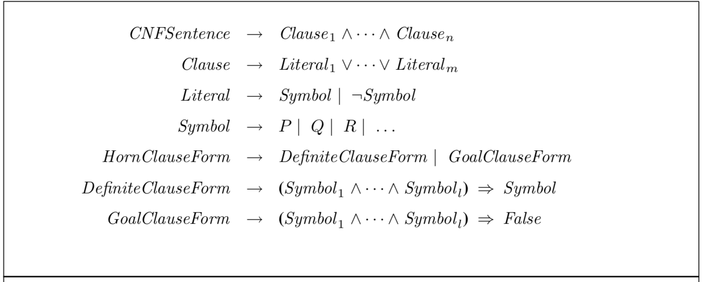
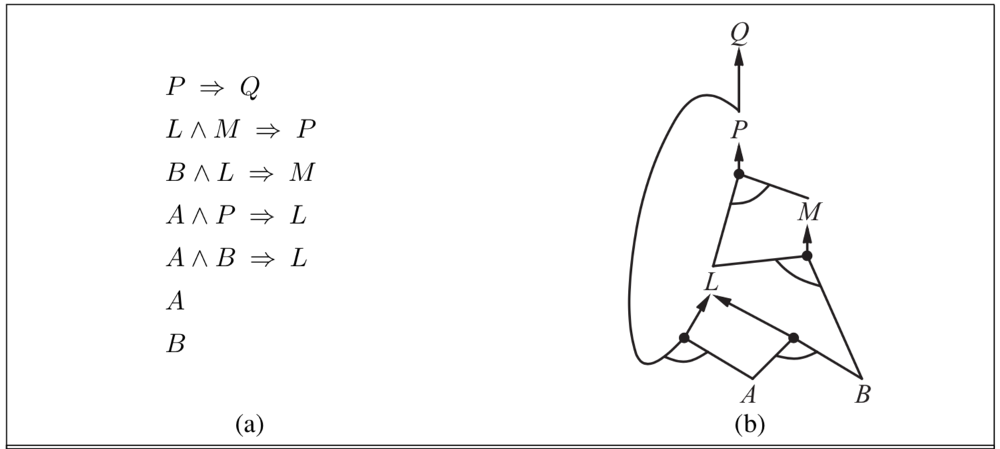

## Propositional Logic

### Background

knowledge representation language is defined by:
* **syntax**: the structure of sentences
* **semantics**: the truth of each sentence in each possible world or model
	* a sentence α is true in model m -> m satisfies α, m is a model of α
	* M(α) -> the set of all models of α.

**entailment**: a sentence follows logically from another sentence.
* α |= β if and only if M(α) ⊆ M(β)
* α is a stronger assertion than β
* **sound** inference derives only sentences that are entailed
* **complete** inference derives all sentences that are entailed

### Syntax

BNF (Backus–Naur Form) grammar of sentences in propositional logic:
* ⇒ (implies): premise ⇒ conclusion (also known as rules or if-then statements)
* ⇔ (if and only if): bidirectional (also written as ≡)

### Semantics

 a model m simply fixes the truth value (true or false) for every proposition symbol.

* ¬P is true iff P is false in m
* P ∧ Q is true iff both P and Q are true in m
* P ∨ Q is true iff either P or Q is true in m
* P ⇒ Q is true unless P is true and Q is false in m
* P ⇔ Q is true iff P and Q are both true or both false in m

### Logical equivalences

**logical equivalence**: two sentences α and β are logically equivalent if they are true in the same set of models, which is written as α ≡ β.
* α ≡ β if and only if α |= β and β |= α

the symbols α, β, and γ stand for arbitrary sentences of propositional logic.

**validity**: a sentence is valid if it is true in all models.
* P ∨ ¬P is valid
* True is valid
* every valid sentence is logically equivalent to True
* **deduction theorem**: for any sentences α and β, α |= β if and only if the sentence (α ⇒ β) is valid.

**satisfiability**: a sentence is satisfiable if it is true in, or satisfied by, some model.
* α is valid iff ¬α is unsatisfiable
* α is satisfiable iff ¬α is not valid
* **proof by contradiction**: α |= β if and only if the sentence (α ∧ ¬β) is unsatisfiable.

### Inference

Inference procedures:
* **model checking**: KB |= α -> enumerate the models and check that α is true in every model in which KB is true
* **theorem proving**: by applying rules of inference directly to the sentences in our knowledge base to construct a proof of the desired sentence without consulting models. 

Inference rules: 
* **Modus Ponens**: α ⇒ β, α -> β (sound)
* **Add Elimination**: α ∧ β -> α, and α ∧ β -> β (sound)
* all of the logical equivalences can be used as inference rules
* **unit resolution**: (α v β), ¬β -> α
* **full resolution**: (α ∨ β), (α ∨ ¬β) -> α

### CNF (Conjunctive Normal Form)

every sentence of propositional logic is logically equivalent to a conjunction of clauses.
* **horn clause**: a disjunction of literals of which at most one is positive.
	* **definite clause**: a disjunction of literals of which exactly one is positive.
	* **goal clause**: a disjunction of literals of which none is positive.

BNF grammar of CNF:
* A ∧ B ⇒ C is a definite clause, when it is written as ¬A ∨ ¬B ∨ C

(a) a set of horn clauses; (b) the corresponding AND-OR graph.

