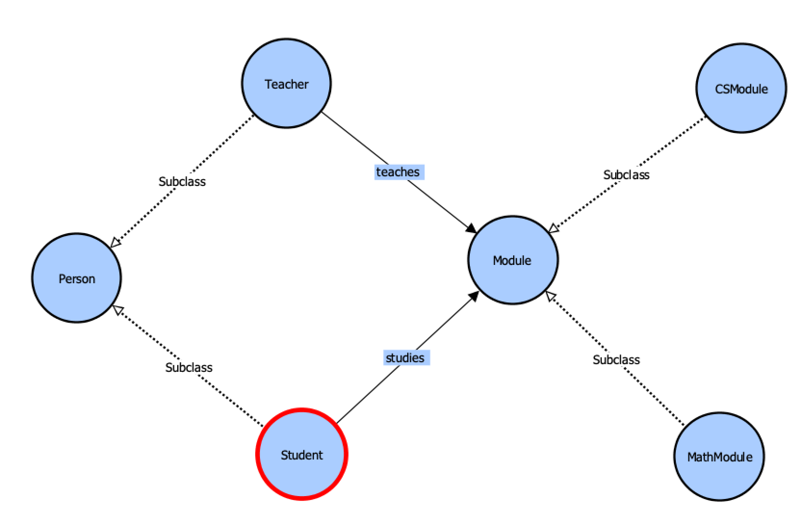

## Protege

### Ontologies:

* **Classes**: Abstract sets of objects, and it comes into classes and sub-classes. (Sub-class/Class are of 'isPartOf' relation?)

* **Object properties**: Relations between classes based on their instances.
	* **Domains**: e.g., Who, which comes from **Classes**. 
	* **Ranges**: e.g., What, which comes from **Classes**.

* **Data properties**: Properties with values.
	* **Ranges**: Data type.

* **Individuals**: Instances of classes.
	* **Types**: 'IsA' relation, which comes from **Classes**.
	* **Object property assertions**: Relation with an instance.
	* **Data property assertions**: Value assignment.

### Visualization of the Ontology

### References

* https://medium.com/@vindulajayawardana/ontology-generation-and-visualization-with-prot%C3%A9g%C3%A9-6df0af9955e0
