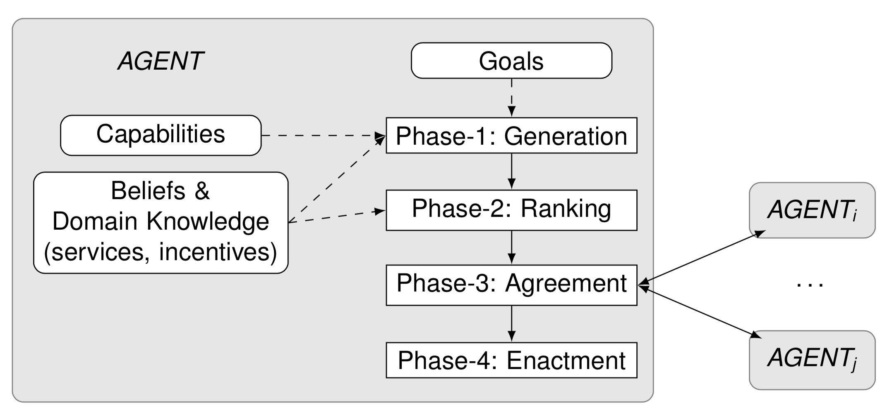
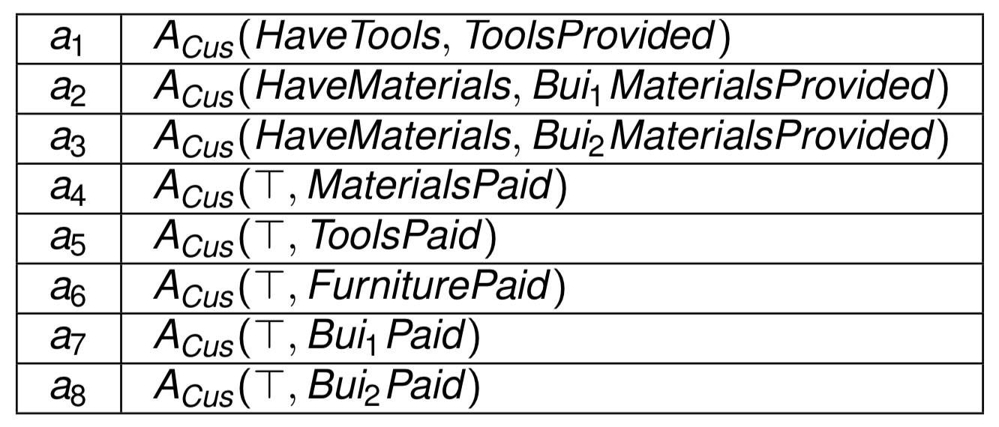
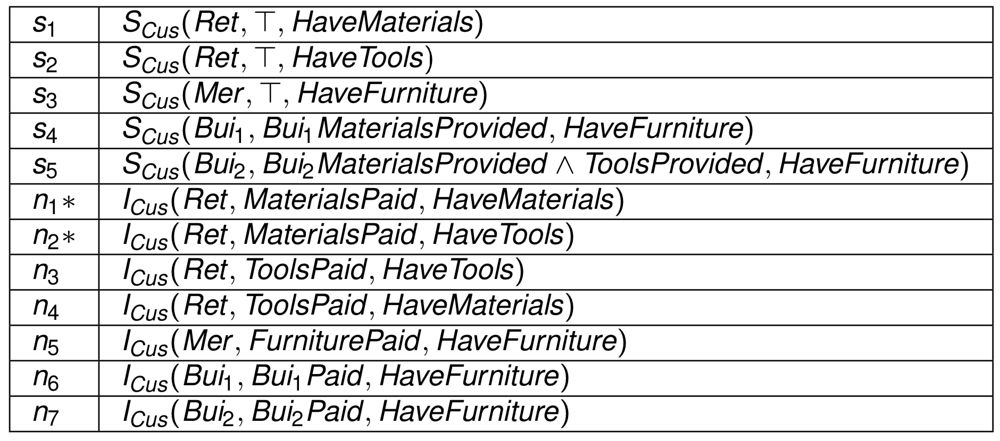
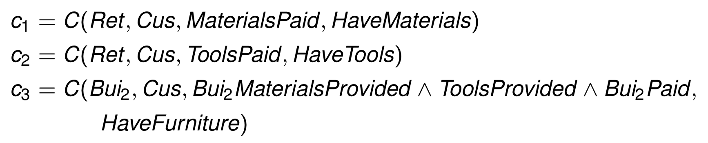
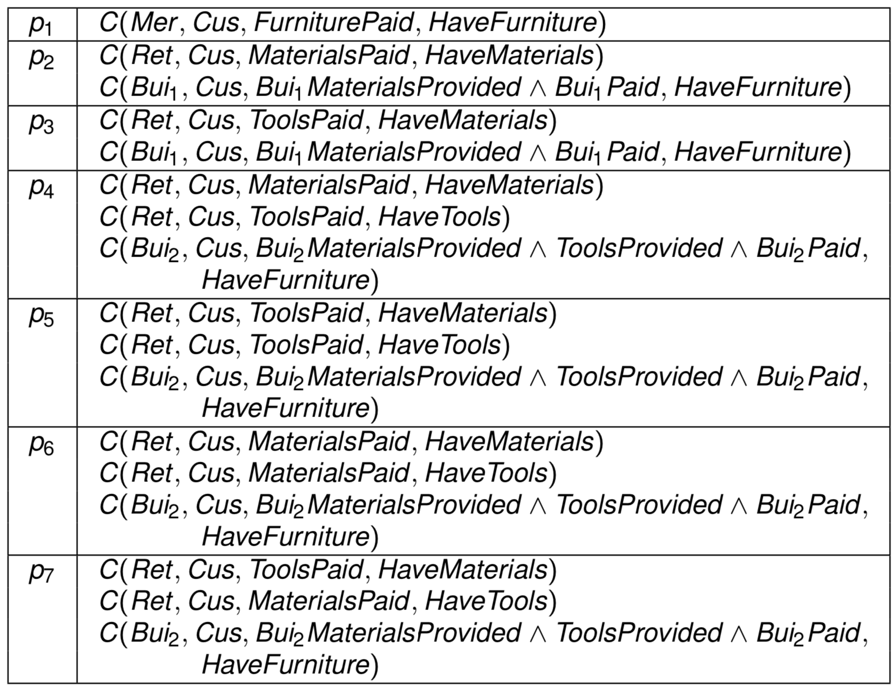
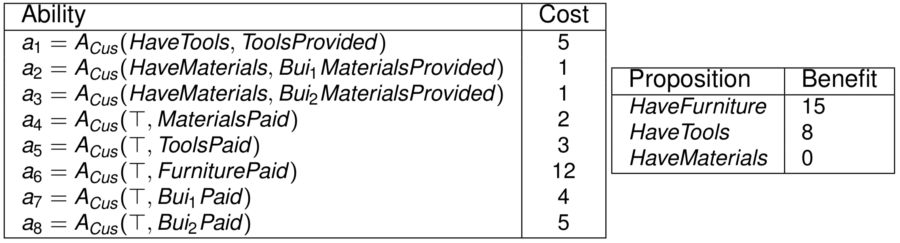
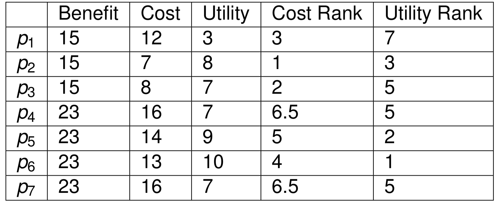
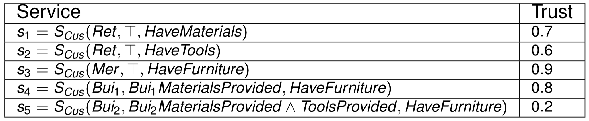
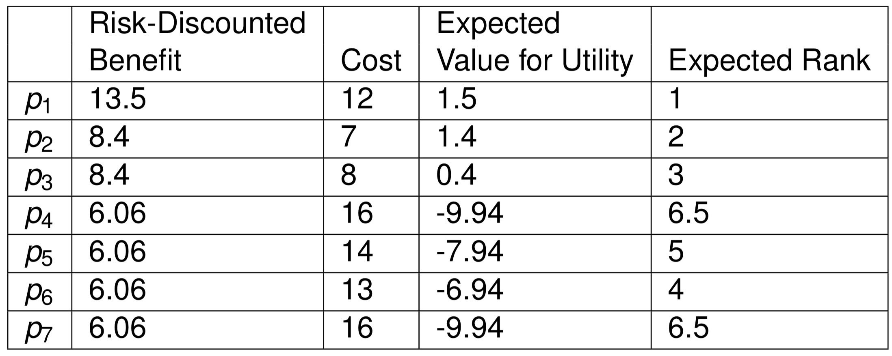

## Dynamic Protocal

### Agent

**Agent** = (G, A, B)
* **Goal** = GX(r): goal of agent x to bring about the proposition r
* **Ability** = AX(d, r): ability of agent x to bring about the proposition r, if precondition d holds
* **Belief**:
	* SX(y, d, r): belief of agent x that agent y can bring about the proposition r, if precondition d holds
	* IX(y, w, r): belief of agent x that agent y can bring about the proposition r, as agent y accepts the proposition w as an incentive

**Commitment protocol**: a set of **commitments** that support the customer’s **goal**
* **Commitment** = C(x, y, d, r): commitment of agent x to agent y to bring about the proposition r, if precondition d holds

Customer's abilities:

Customer's beliefs:

Commitments:

### Generation

The generated protocols:

### Ranking

**Benefit** of protocol: utility of **goals**

**Cost** of protocol: cost of **abilities** the generator agent utilizes

**Utility** = **Benefit** of protocol - **Cost** of protocol

* Benefit of p5 = 0 + 8 + 15 = 23
* Cost of p5 = cost(a1) + cost(a3) + cost(a5) + cost(a8) = 5 + 1 + 3 + 5 = 14
* Utility of p5 = 23 - 14 = 9

### Ranking with Trust

* Benefit of p4 = benefit(HaveMaterials) * trust(HaveMaterials) + benefit(HaveTools) * trust(HaveTools) + benefit(HaveFurniture) * trust(HaveFurniture) = 0 + 8 * (0.6 * 1) + 15 * (0.7 * 0.6 * 0.2) = 0 + 8 * 0.6 + 15 * 0.084 = 6.06

