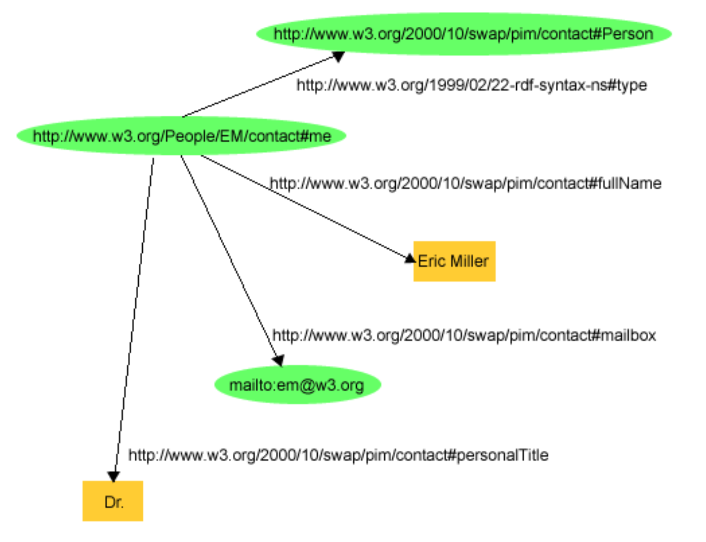
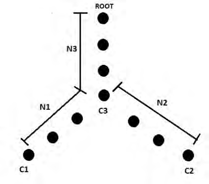

## RDF & RDFS & OWL

### RDF

**RDF**
* **Triples** of <**Subject**, **Predicate**, **Object**>
	* <Eric Miller, hasTitle, Dr.>
* Each has URI
* **Container**: **Subject** and **Object** can be plural
	* **Bag**: No order, Allow duplicates
	* **Seq**: Order, Allow duplicates
	* **Alt**: Alternatives
* **Collection** = Enumeration
* **Reification**: RDF statements about other RDF statements

**Reification** example:
```
<rdf:Description rdf:ID=”item10245”>
	<exterms:weight rdf:datatype=”xsd:decimal”>2.4</exterms:weight>
</rdf:Description>

<rdf:Statement rdf:about=”#triple12345”>
	<rdf:subject rdf:resource=”http://www.example.com/2002/04/products#item10245” />
	<rdf:predicate rdf:resource=”http://www.example.com/terms/weight” />
	<rdf:object rdf:datatype=”xsd:decimal”>2.4</rdf:object>
	<dc:creator rdf:resource="http://www.example.com/staffid/85740" />
</rdf:Statement>
```

**RDF Graph**: Show triples with edges between nodes


**RDF Syntax**:
```
<?xml version=”1.0”?>
<rdf:RDF xmlns:rdf=”http://www.w3.org/1999/02/22−rdf−syntax−ns#”
	xmlns:contact=”http://www.w3.org/2000/10/swap/pim/contact#”>

	<contact:Person rdf:about=”http://www.w3.org/People/EM/contact#me”>	
		<contact:fullName>Eric Miller</contact:fullName>
		<contact:mailbox rdf:resource=”mailto:em@w3.org” />
		<contact:personalTitle>Dr.</contact:personalTitle>
	</contact:Person>

</rdf:RDF>
```

### RDFS

**RDF** is a vocabulary for creating **instances**

**RDFS** is a vocabulary for creating **classes**

* **classes**:
	* ex:Person rdf:type **rdfs:Class**
	* ex:Player rdf:type ex:Person
	* ex:Footballer **rdfs:subClassOf** ex:Player
* classes have **properties**:
	* ex:Driver rdf:type **rdf:Property**
	* ex:primaryDriver rdf:type **rdf:Property**
	* ex:primaryDriver **rdfs:subPropertyOf** ex:Driver
* **domain** denotes "from" values for a property
	* ex:Book rdf:type rdfs:Class
	* ex:author rdf:type rdf:Property
	* ex:author **rdfs:domain** ex:Book
* **range** denotes "to" values for a property
	* ex:author **rdfs:range** ex:Person
* a **property** can have 0 or more domains and ranges

### RDF & RDFS vs DL

**RDF & RDFS**:
* MarriedWoman rdfs:subClassOf Woman
* hasMaidenName rdfs:domain MarriedWoman
* hasMaidenName rdfs:range Name
* “Karen” hasMaidenName ”Stephens”

What can we infer?
* “Karen” rdf:type MarriedWoman
* “Karen” rdf:type Woman 
* “Stephens” rdf:type Name

**DL**:
* MarriedWoman ⊑ Woman
* ∃hasMaidenName.T ⊑ MarriedWoman
* ⊤ ⊑ ∀hasMaidenName.Name

### OWL Classes

**OWL Union**:
```
<owl:Class rdf:ID=”food#Fruit”>
	<owl:unionOf rdf:parseType=Collection> 
		<owl:Class rdf:resource=”food#SweetFruit” /> 
		<owl:Class rdf:resource=”food#NonSweetFruit” /> 
	</owl:unionOf>
</owl:Class>
```

**OWL Intersection**
```
<owl:Class rdf:ID=”food#SugaryBread”>
	<owl:intersectionOf rdf:parseType=Collection> 
		<owl:Class rdf:about=”food#Bread” /> 
		<owl:Class rdf:about=”food#SweetFruit” />
	</owl:intersectionOf>
</owl:Class>
```

**OWL Complement**
```
<owl:Class> 
	<owl:complementOf>
		<owl:Class rdf:about=”food##Meat” />
	</owl:complementOf> 
</owl:Class>
```

**OWL Equivalence & Disjointness**
```
<owl:Class rdf:about=”food#Fruit”>
	<rdfs:subClassOf rdf:resource="food#EdibleThing" />

	<owl:disjointWith rdf:resource="food#Dessert" />
	<owl:disjointWith rdf:resource="food#Seafood" />
	<owl:disjointWith rdf:resource="food#Meat" />

	<owl:equivalentClass>
		<owl:Class>
			<owl:unionOf rdf:parseType=”Collection”> 
				<rdf:Description rdf:about=”food#NonSweetFruit” /> 
				<rdf:Description rdf:about=”food#SweetFruit”/>
			</owl:unionOf>
		</owl:Class>
	</owl:equivalentClass>
</owl:Class>
```

**OWL Enumeration**
```
<owl:Class rdf:ID=”Continent”>
	<owl:oneOf rdf:parseType=”Collection”>
		<owl:Thing rdf:about=”#Europe” />
		<owl:Thing rdf:about=”#Asia />
		<owl:Thing rdf:about=”#Africa />
	</owl:oneOf>
</owl:Class>
```

### OWL Properties

**Transitive property**: P(x, y) and P(y, z) implies P(x, z)
```
<owl:ObjectProperty rdf:ID=”locatedIn”>
	<rdf:type rdf:resource=”owl#TransitiveProperty” /> 
	<rdfs:domain rdf:resource=”owl#Thing” />
	<rdfs:range rdf:resource=”#Region” />
</owl:ObjectProperty>

<Region rdf:ID=”SantaCruzMountainsRegion”>
	<locatedIn rdf:resource=”#CaliforniaRegion” />
</Region>

<Region rdf:ID=”CaliforniaRegion”> 
	<locatedIn rdf:resource=”#USRegion” />
</Region>
```

**Symmetric property**: P(x, y) iff P(y, x)
```
<owl:ObjectProperty rdf:ID=”adjacentRegion”> 
	<rdf:type rdf:resource=”owl#SymmetricProperty” /> 
	<rdfs:domain rdf:resource=”#Region” />
	<rdfs:range rdf:resource=”#Region” />
</owl:ObjectProperty>

<Region rdf:ID=”MendocinoRegion”>
	<adjacentRegion rdf:resource=”#SonomaRegion” /> 
</Region>
```

**Functional property**: P(x, y) and P(x, z) implies y = z
```
<owl:Class rdf:ID=”VintageYear” /> 

<owl:ObjectProperty rdf:ID=”hasVintageYear”>
	<rdf:type rdf:resource=”owl#FunctionalProperty”/> 
	<rdfs:domain rdf:resource=”#Vintage” /> 
	<rdfs:range rdf:resource=”#VintageYear” />
</owl:ObjectProperty>
```

**Inverse property**: P1(x, y) iff P2(y, x)
```
<owl:ObjectProperty rdf:ID=”hasMaker”>
	<rdf:type rdf:resource=”owl#FunctionalProperty” />
</owl:ObjectProperty>

<owl:ObjectProperty rdf:ID=”producesWine”>
	<owl:inverseOf rdf:resource=”#hasMaker” /> 
</owl:ObjectProperty>
```

**Inverse functional property**: P(y, x) and P(z, x) implies y = z
```
<owl:ObjectProperty rdf:ID=”hasMaker” /> 

<owl:ObjectProperty rdf:ID=”producesWine”>
	<rdf:type rdf:resource=”owl#InverseFunctionalProperty” />
	<owl:inverseOf rdf:resource=”#hasMaker” /> 
</owl:ObjectProperty>
```

**OWL Restriction**
* Wine ⊑ PotableLiquid ⊓ ∀hasMaker.Winery
```
<owl:Class rdf:ID=”Wine”>
	<rdfs:subClassOf rdf:resource=”food#PotableLiquid” /> 

	<rdfs:subClassOf>
		<owl:Restriction>
			<owl:onProperty rdf:resource=”food#hasMaker” /> 
			<owl:allValuesFrom rdf:resource=”food#Winery” />
		</owl:Restriction> 
	</rdfs:subClassOf>
</owl:Class>
```

* Wine ⊑ PotableLiquid ⊓ ∃locatedIn.Region
```
<owl:Class rdf:ID=”Wine”>
	<rdfs:subClassOf rdf:resource=”food#PotableLiquid” /> 

	<rdfs:subClassOf>
		<owl:Restriction>
			<owl:onProperty rdf:resource=”#locatedIn” />
			<owl:someValuesFrom rdf:resource=”#Region” />
		</owl:Restriction> 
	</rdfs:subClassOf>
</owl:Class>
```

* WhiteWine ⊑ Wine ⊓ hasColor.{White}
```
<owl:Class rdf:ID=”WhiteWine”>
	<owl:intersectionOf rdf:parseType=”Collection”>
		<owl:Class rdf:about=”#Wine” /> 
		<owl:Restriction>
			<owl:onProperty rdf:resource=”#hasColor” />
			<owl:hasValue rdf:resource=”#White” /> 
		</owl:Restriction>
	</owl:intersectionOf>
</owl:Class>
```

### OWL Instances

**Same** instances:
```
<ex:Country rdf:ID="Iran" /> 

<ex:Country rdf:ID="Persia">
	<owl:sameIndividualAs rdf:resource="#Iran" /> 
</ex:Country>
```

**Different** instances:
```
<owl:AllDifferent>
	<owl:distinctMembers rdf:parseType="Collection">
		<ex:Country rdf:ID="Russia" />
		<ex:Country rdf:ID= "India" />
		<ex:Country rdf:ID= "USA" />
	</owl:distinctMembers>
</owl:AllDifferent>
```

### Manchester Syntax

* A **conjunction** of descriptions: **and**
* **Class** name
* **DataProperty**
	* **value** individual
	* **some** range
	* **min**/**max**/**exactly** 
* **ObjectProperty**
	* **value** individual
	* **some**/**only** restriction

Examples:
* CaliforniaWine and not (hasBody value Medium)
* Wine and locatedIn some (Region and adjacentRegion value MendocinoRegion

### Similarity

**Tversky’s metric**
* Compare individuals by property values
* S = α(common) / α(common) + α(different)

**Wu and Palmer’s metric**
* S = 2 * N<sub>3</sub> / N<sub>1</sub> + N<<sub>2</sub> + 2 * N<sub>3</sub>
<p float="left">
	
</p>

### Reference

* https://www.w3.org/TR/rdf-mt/#Reif
* https://www.w3.org/2011/rdf-wg/wiki/XSD_Datatypes
* http://dbpedia.org/page/The_Lord_of_the_Rings
* https://bioportal.bioontology.org/ontologies/SNOMEDCT
* https://lod-cloud.net/


