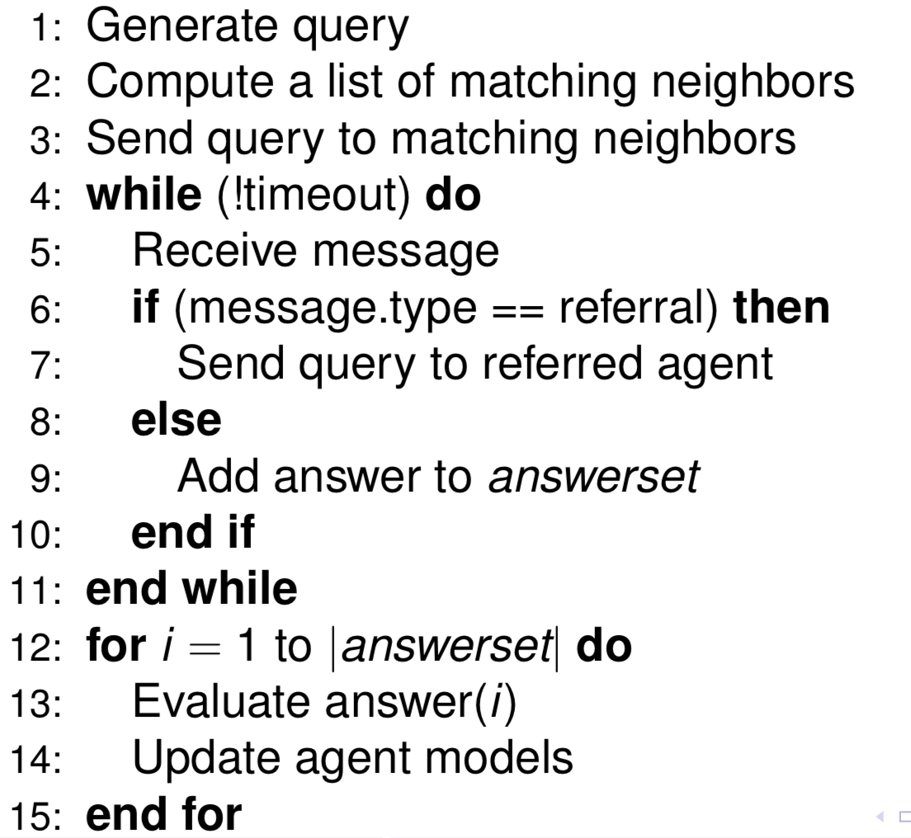
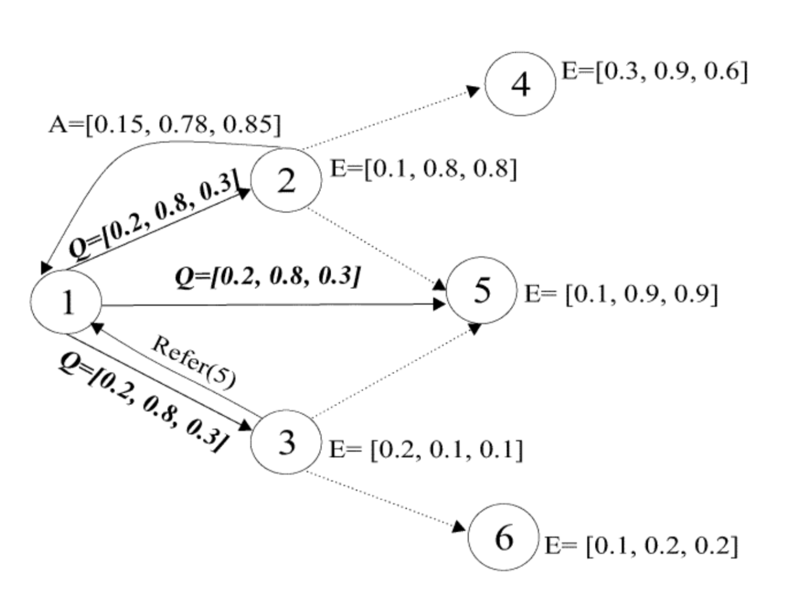

## Referral

	

* **Interest**: What kind of information it is looking for -> represented as a vector
* **Expertise**: What kind of queries it can answer (know-how) -> represented as a vector
* **Sociability**: How likely it is to know others with the right answer (know-who) -> represented as a scalar

Example is as below:

