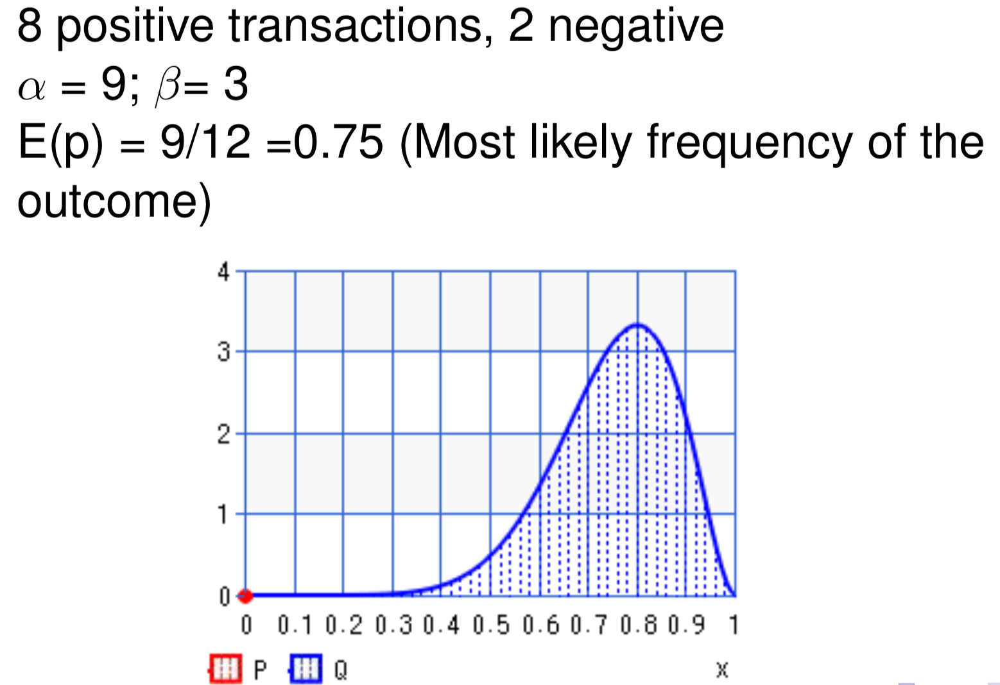

## Trust

### Luhmann’s distinction
* **Hope**: Wish it will come true (no basis)
* **Confidence**: Think it will come true (based on evidence)
* **Trust**: Commit to action with partly uncertain consequences

### Computational trust
1. Send request to service providers
2. Receive a service
3. Evaluate the service
4. Update the **model** of service providers based on **evidence**

**Local trust**:
* many service providers
* service providers enter and leave

**Institutional trust**:
* **centralized** reputation system
* **privacy**: raters may not reveal true ratings in public
* **trust**: it is unknown where the ratings come from

**Social trust**:
* ask those you trust
* **context**: the context of usage may be unspecified
* **satisfaction criteria**: the expectations of the raters may be different

### Beta-Reputation system

* **Beta density function** is used for **binary events**
* α = r + 1 and β = s + 1
	* r = occurrences of x (successful transactions)
	* s = occurrences of x' (unsuccessful transactions)
* The probability expectation of **beta distribution**: E(p) = α / (α + β)

	

* X(pXT) = T’s reputation by agent X
* E(pXT) = (rXT +1) / (rXT + sXT + 2) -> [0, 1]
* Rep(rXT, sXT) = (E(pXT) - 0.5) * 2 -> [-1, 1]

### Belief theory

wXY = (bXY, dXY, uXY): X’s opinion of Y for **belief**, **disbelief**, **uncertainty**

Given X’s opinion of Y (wXY = (bXY, dXY, uXY)) and Y’s opinion of T (wYT = (bTT, dYT, uYT)), how much X should trust T (wXT = (bXT, dXT, uXT))?

**individual b, d, u**
* b = r / (r + s + 2)
* d = s / (r + s + 2)
* u = 2 / (r + s + 2)

**transitive b, d, u**
* bXT = bXY * bYT
* dXT = bXY * dYT
* uXT = dXY + uXY + bXY * uYT

**Discounted reputation** (rXT, sXT) = (2*b/u, 2*d/u)

Rep(rXT, sXT) = (((r + 1) / (r + s + 2)) - 0.5) * 2 -> [-1, 1]

