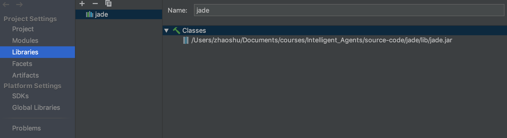
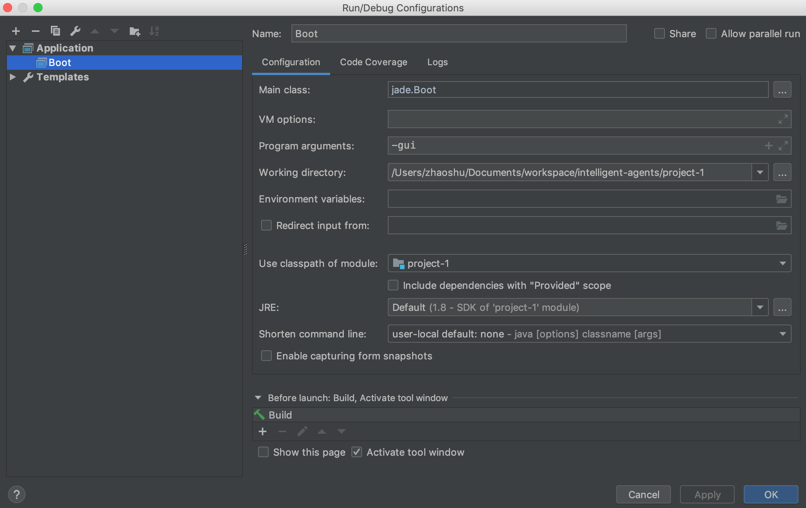
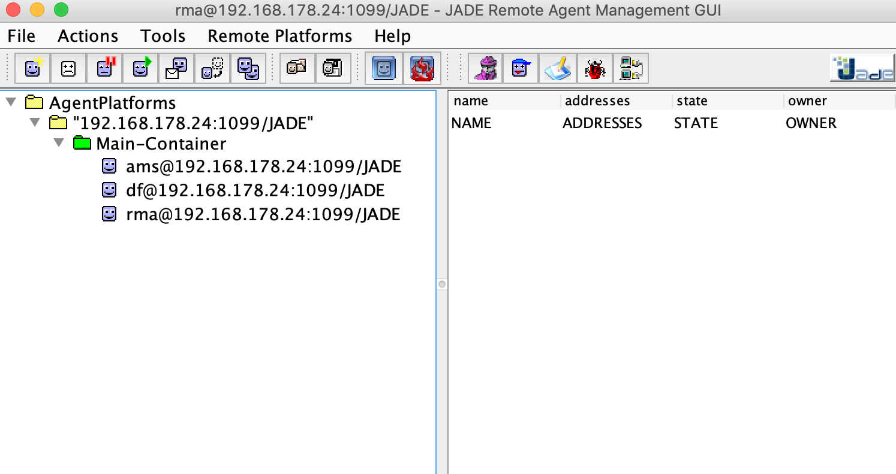

## Project Description

You will design and implement a personal assistant agent that will help a new master student choose courses. The student might have certain courses already in mind (e.g., definitely take Multiagent Systems), preferences for type of courses she would like to take (e.g., follow courses that require logic), preferences for courses to avoid based on a property (e.g., never take a course on Friday or never take a course with a final exam) as well as obligations to follow (e.g., each student must take Methods of AI Research course).
The agent should take into account the student's preferences and obligations and generate a schedule for the student. The schedule should be for a few semesters. When doing so, the agent should use knowledge about the program, the courses, and the user and reason on this knowledge to make choices. Ideally, the agent should be able to provide explanations as to why each course is chosen.
You should be able to show how the agent produces schedules for different users.

### How to setup JADE on IntelliJ

Step 1: Download https://jade.tilab.com/dl.php?file=JADE-bin-4.5.0.zip and extract the package:
```
$ jar xvf /path/to/JADE-bin-4.5.0.zip
```

Step 2: Create Java project in IntelliJ and click 'File > Project Structure > Libraries' to add jade.jar in the classpath:


Step 3: Click 'Run > Edit Configurations... > Application' and add a new Java application configuration:


Finally run the sample code with the above configuration, and below GUI will pop up:
