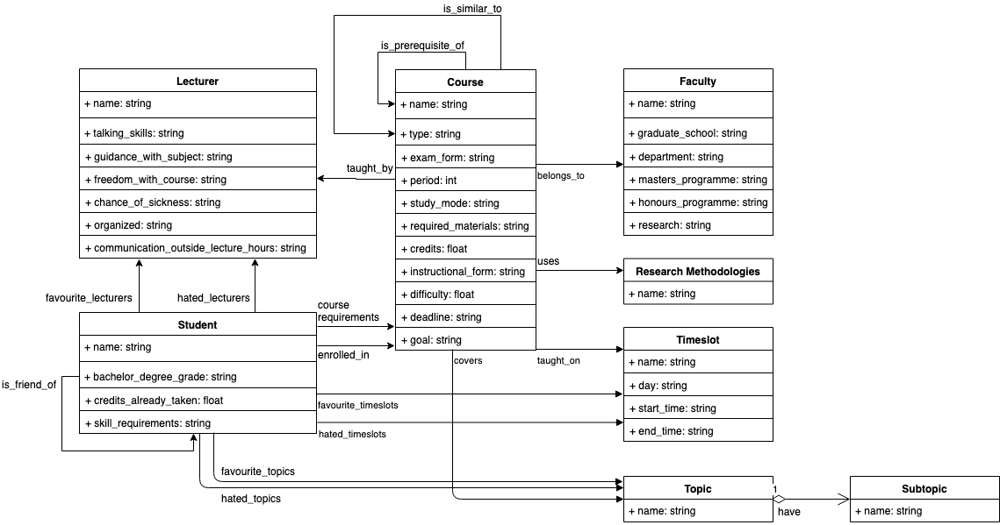

## Project Report

The concepts and the relations in-between are shown in the below diagram:

* Each concept displays as a table.
* The concept's data properties display as rows in the table.
* The concept's object properties display as arrows between tables.

Let's go through their DL descriptions in detail:

* Each course is taught by at least one lecturer: 
  
  Course ⊑ ∃is_taught_by.Lecturer, (Course ⊓ ¬∃is_taught_by.Lecturer) ⊑ ⊥

* The course is taught on exactly two different days: 

  Course ⊓ ≤2 is_taught_on.Timeslot ⊓ ≥2 is_taught_on.Timeslot

* Each lecturer teaches at most one course every period: 

  (Lecturer ⊓ ≥1 is_teaching.Course ⊓ ≤1 is_teaching.Course) ⊓ (Course ⊓ ≥1 is_in.Period ⊓ ≤1 is_in.Period)

* Each course is on a set of topics: 

  Course ⊓ ∃covers.Topic

* Each course uses exactly one research methodology: 

  Course ⊓ ≤1 uses.Research_Methodologies ⊓ ≥1 uses.Research_Methodologies

* A course might be a prerequisite for a course: 

  Course ⊔ ∃is_prerequisite_of.Course

* A course is considered similar to another course if there is an overlap on topics and the same research methodology is used: 

  c1: Course, c2: Course, r: Research_Methodologies, t: Topic, (c1, r): uses, (c2, r): uses, (c1, t): covers, (c2, t): covers -> (a, b): is_similar_to, (b, a): is_similar_to (symmetric)

* Topics are organized in a hierarchy, two topics could be disjoint or have overlaps: 

  Topic ⊔ ∃is_part_of.Topic

* A course might be a prerequisite for a course: 

  Course ⊔ ∃is_prerequisite_of.Course

* A student might prefer (not) to take a course by a certain lecturer, or on a certain day, or on a certain topic: 

  l: Lecturer, s: Student, (s, l): has_favourite_lecturers, c: Course, (c, l): is_taught_by -> (s, c): is_enrolled_in

* At any given period, a student can take at least two and at most three courses: 

  Student ⊓ ≥2 is_enrolled_in.Course ⊓ ≤3 is_enrolled_in.Course (at any given period?)

* A student cannot register for a course more than once: 

  Student ⊓ ≥2 is_enrolled_in.{c1}, c1: Course 

* A student can take a course only if she has taken the prerequisite:

  Student ⊓ ∀is_enrolled_in.(Course ⊔ ∃is_prerequisite_of.Course)

* When a student has an option between two courses that are equally preferable, the student would like to take a course that her friend takes:

  s1: Student, s2: Student, c: Course, (s1, s2): is_friend_of, (s2, s1): is_friend_of, (s1, c): is_enrolled_in -> (s2, c): is_enrolled_in
  

