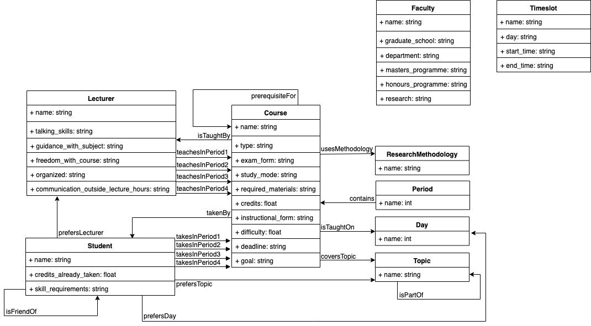

## Project Report

The concepts and the relations in-between are shown in the below diagram:
* Each concept displays as a table
* The concept's data properties display as rows in the table
* The concept's object properties display as arrows between tables

Let's go through their DL descriptions in detail:
* **Student**: 
  
