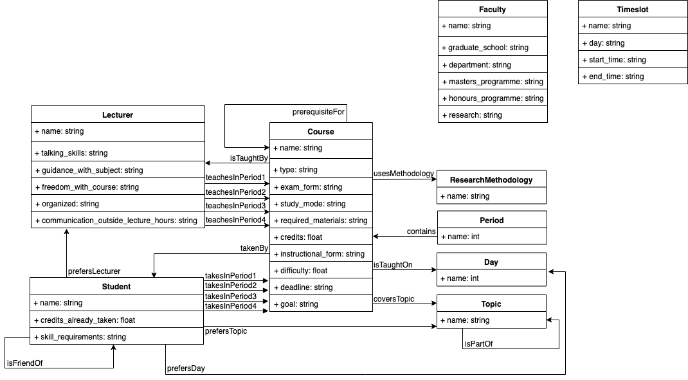

## Project Report

### Concepts and Relations


### Knowledge Base TBox in DL

Each course is taught by at least one lecturer
```
Course ⊑ ∃IsTaughtBy.Lecturer
```

The course is taught on exactly two different days
```
Course ⊑ =2isTaughtOn.Day
```

Each lecturer teaches at most one course every period
```
Lecturer ⊑ ≤1teachesInPeriod1.Course ⊔ ≤1teachesInPeriod2.Course ⊔ ≤1teachesInPeriod3.Course ⊔ ≤1teachesInPeriod4.Course
```

Each course is on a set of topics
```
Course ⊑ ∃coversTopic.Topic
```

Each course uses exactly one research methodology
```
Course ⊑ =1usesMethodology.ResearchMethodology
```

A course might be a prerequisite for a course
```
∀prerequisiteFor.Course ⊑ Course
```

Topics are organized in a hierarchy
```
∀isPartOf.Topic ⊑ Topic
```

two topics could be disjoint or have overlaps
```
Topic ⊑ Agent ⊔ ArtificialIntelligence ⊔ IntelligentAgent ⊔ ... ⊔ Graphics
Agent ⊑ ¬Graphics
ArtificialIntelligence ⊑ ¬Graphics
IntelligentAgent ⊑ Agents ⊓ ArtificialIntelligence
```

A student might prefer (not) to take a course by a certain lecturer, or on a certain day, or on a certain topic
```
∀perfersLecturer.Lecturer ⊑ Student
∀perfersDay.Day ⊑ Student
∀perfersTopic.Topic ⊑ Student
```

At any given period, a student can take at least two and at most three courses
```
Student ⊑ (≥2takesInPeriod1.Course ∩ ≤3takesInPeriod1.Course) ⊓ (Student ⊑ ≥2takesInPeriod2.Course ∩ ≤3takesInPeriod2.Course) ⊓ (Student ⊑ ≥2takesInPeriod3.Course ∩ ≤3takesInPeriod3.Course) ⊓ (Student ⊑ ≥2takesInPeriod4.Course ∩ ≤3takesInPeriod4.Course)
```
 
The prerequisite TBox in DL
```
Person ⊑ Lecturer ⊔ Student
```

### Knowledge Base ABox in DL

* A student cannot register for a course more than once
* A student can take a course only if she has taken the prerequisite
* When a student has an option between two courses that are equally preferable, the student would like to take a course that her friend takes
* A course is considered similar to another course if there is an overlap on topics and the same research methodology is used
